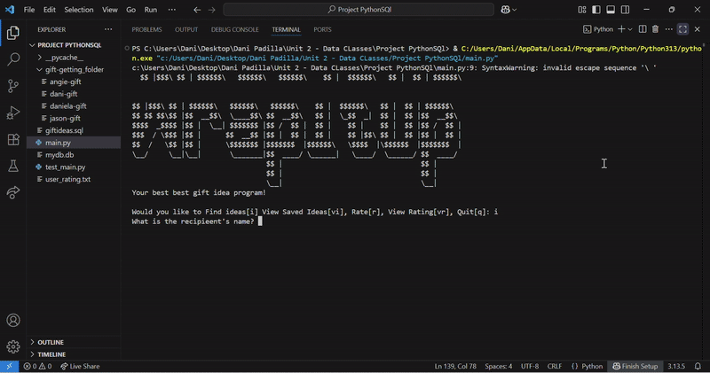

    
  
  # **WrapItUp**

  ## **DESCRIPTION**
  "WrapItup" is a program that generates gift ideas based on the requirements that the user fills out. 

  COLOR PALETTE            |  DEMO
:-------------------------:|:-------------------------:
   |   

## **KEY FEATURES:**

 1. **Idea Recommendations:**
   - Collects the recipients infromation.
   - Displays the personalized gift ideas based on the user input.
   - Want to make sure we save your ideas for each recipient? Our program allows the user to save the ideas they want.

 2. **View Saved Ideas:**
   - User can decide which recipient saved ideas they wants to see.
   - Displays the saved ideas that the user wants to view.
  
 3. **Rate/View Rating**
   - We want to make sure that our code is up to the standards of the user. That is why we have a rate option.
   - Users can rate our program from 1- to 5 stars to help us improve.
   - Users can also view the rating that past user have made on our program.
  
## **Inspiration** ##
   - We created WrapItUp to help people who struggle with gift giving decisions and often end up buying the wrong things. Our user friendly program solves that problem and saves some stress. 

## **HOW TO USE (Visual Studio Code)**
  1. Install Python to your computer.
  2. Download [Visual Studio Code](https://www.youtube.com/watch?v=HxJXKFxhah4)
  3.  Install the extentions "Python" by Microsoft and "SQLite" by alexcvzz
  4.  Clone this repository
  5.  Open the project
  6.  Open the giftideas.sql file
  7.  Highlight  
  CREATE TABLE gift_idea (
    gift_name TEXT,
    gender TEXT,
    age TEXT,
    occasion TEXT,
    interest TEXT
); 
  8.  Double click and select "Run Selected Query"
  9.  Highlight all the data entries, then double-click and select "Run Selected Query"
  10. Open the main.py file and run the program in the terminal and you are set!

